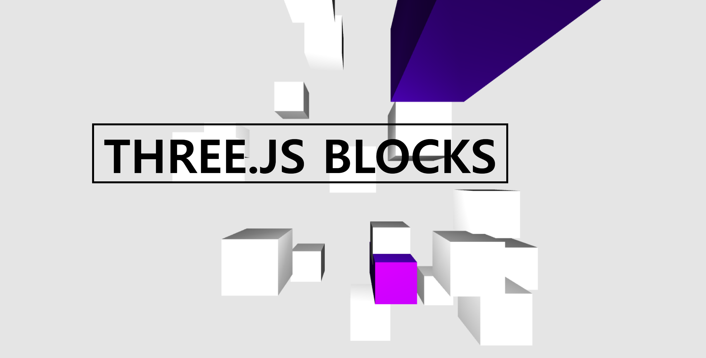

# Moving Blocks 3D

## capture

-   Canvas
-   Three.js
-   two lights
-   Random position blocks
-   Camera
-   Renderer
-   Mouse animation - mouse move trigger, scale, position, rotation, color are changed.
-   Using Raycast - captures mouse position
